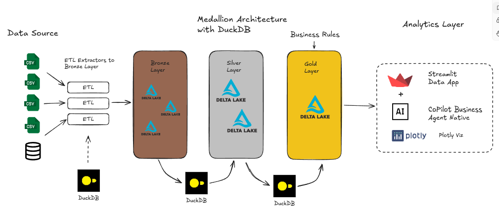

# Olist Data Project

## Description
Data engineering and analysis project using real commercial data from the Brazilian e-commerce platform Olist. The architecture consumes a single data source (in .csv format) publicly available. Learn more about the dataset: [Kaggle - Brazilian E-Commerce Public Dataset](https://www.kaggle.com/datasets/olistbr/brazilian-ecommerce).

## About the Dataset
Public dataset of Brazilian e-commerce from Olist. This dataset contains information on 100,000 orders placed between 2016 and 2018 across various marketplaces in Brazil. The data allows viewing orders across multiple dimensions: status, price, payment, shipping performance, customer location, product attributes, and customer-written reviews. A geolocation dataset is also available, linking Brazilian postal codes to lat/lng coordinates.

These are real commercial data that have been anonymized. References to companies and partners have been replaced with the names of the great houses of Game of Thrones.

## Data Engineering
The data engineering of this project used a list of tools and methods, including:
- DuckDB
- Delta Lake
- Medallion Architecture (Bronze, Silver, and Gold)

### Project Architecture

## Data Schema
The data is divided into several sets for better understanding and organization. Refer to the following data schema when working with it:

## Objective
The focus of this project is to apply fundamental concepts of data engineering and analysis, delivering results through dashboards, reports, and using Business Intelligence (BI).

## BI Dashboard
The dashboard for this project was built using the Python libraries: Streamlit and Plotly. Moreover, this Data App features a native AI Agent to assist users with decision-making and data exploration beyond the static visualization of Streamlit, allowing for understanding and answering complex and strategic questions based on the data.

<video autoplay loop muted playsinline>
  <source src="./assets/video/dashboard_olist_data_project_demo.mp4" type="video/mp4">
  Your browser does not support the video tag.
</video>

### CoPilot Business Agent
The dashboard's native AI Agent is called the Copilot Business Agent. It functions as a tool for exploration, analysis, and guidance based on the data present in the dashboard.

<video autoplay loop muted playsinline>
  <source src="./assets/video/copilot_business_agent_demo.mp4" type="video/mp4">
  Your browser does not support the video tag.
</video>

## BI Report
Here is a summary of the BI report with insights, business opportunities, and recommended actions revealed in this project:

### 🔍 Relevant Insights Found
- **Low cancellations:** Only a 2.38% rate, indicating good customer satisfaction.
- **Early deliveries:** Negative average delay shows logistical efficiency.
- **Healthy average ticket:** R$160.99 per sale, useful for marketing actions.
- **Solid customer base:** Potential for more strategic segmentations.
- **Sales variation:** Some categories with high growth potential.

### 💡 Business Opportunities
- **Increase satisfaction:** Monitor negative feedback and further reduce cancellations.
- **Improve logistics:** Replicate good practices of fast deliveries in other areas.
- **Segmented campaigns:** Focus on categories with high variability and good ticket.
- **Personalization:** Create offers based on customer profile and behavior.
- **Sales training:** Support for those below average performance.
- **Price and shipping adjustments:** Tests to find the optimal revenue point.
- **Explore new markets:** Expand into regions with unmet demand, such as in the city of Curitiba-PR, where there is an expansion opportunity (Demand/Supply Index of 1.6, one of the highest in the country).

### ✅ Recommended Actions
- 🗣️ Satisfaction surveys to understand the customer.
- 🎁 Loyalty programs to increase repurchase.
- 📊 Continuous monitoring for strategic adjustments.